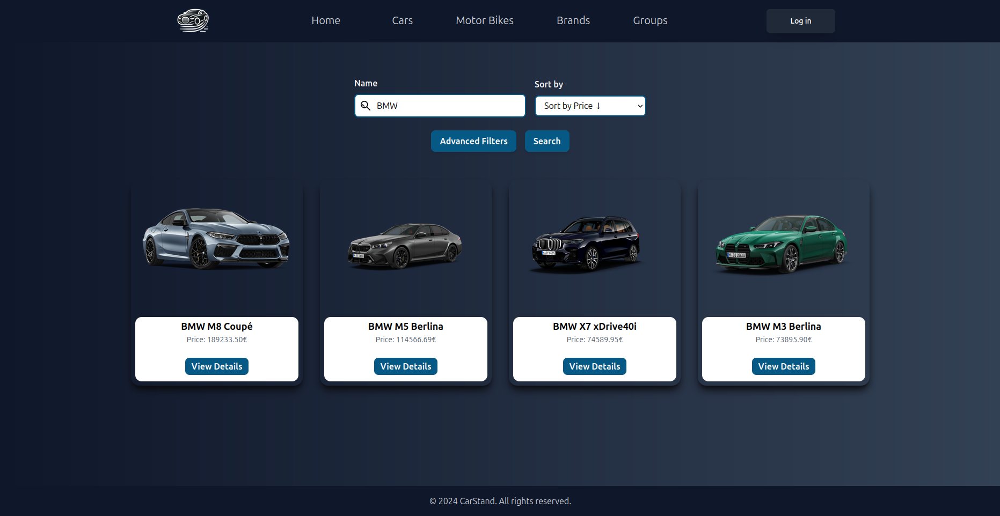
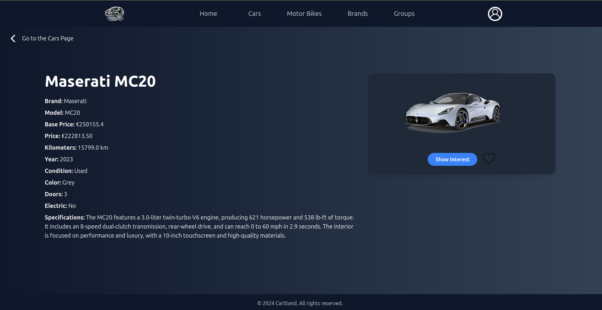
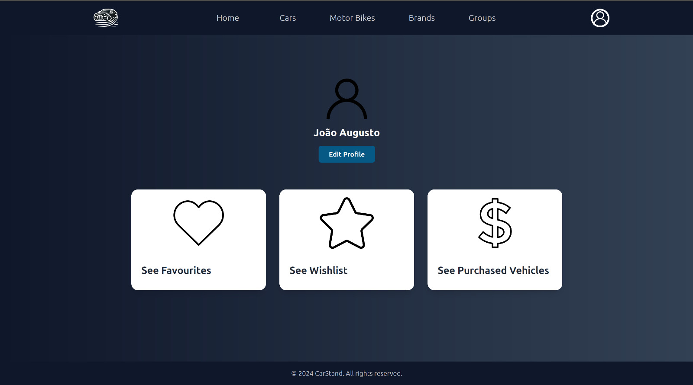
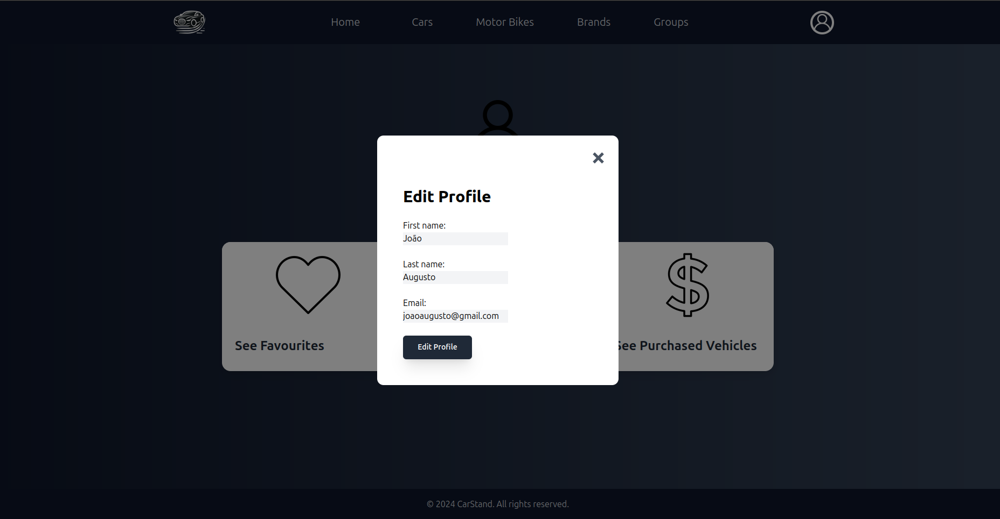
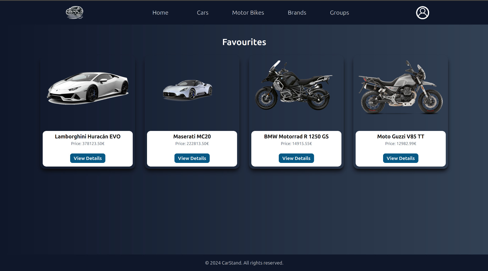
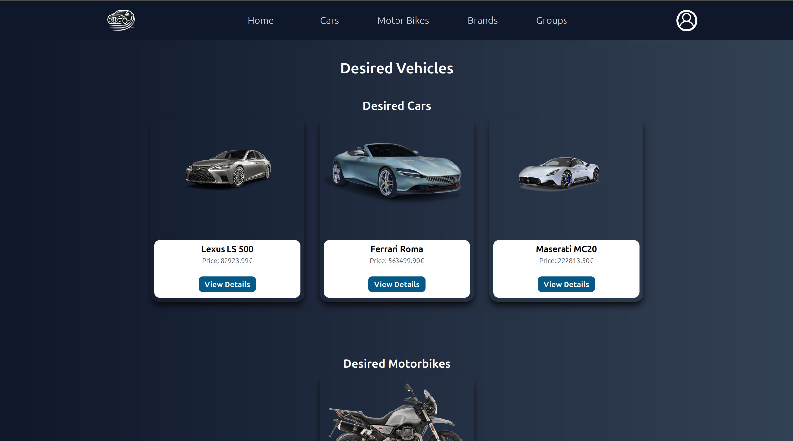
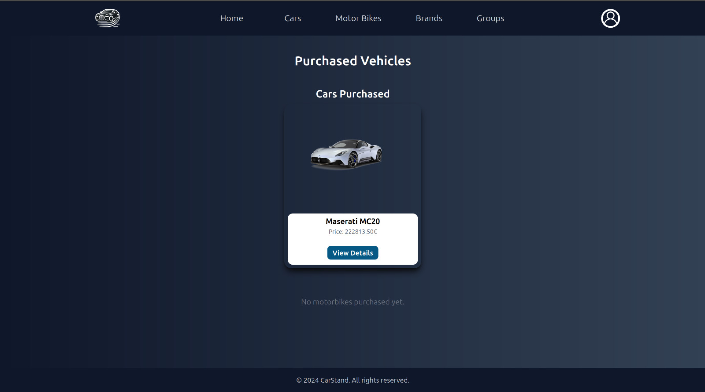
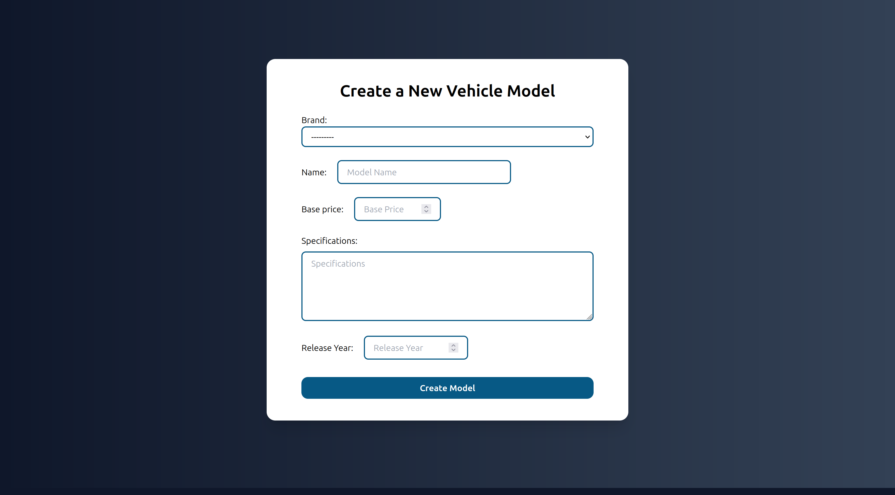

# CarStand

**TPW - Project 2**

**Students**:

João Viegas - 113144

Jorge Domingues - 113278

João Monteiro - 114547

## Introduction

**CarStand** is a web-based system designed to manage a vehicle stand. The system is structured into 5 classes: Groups, Brands, Models, Cars and Motos. It allows users to check what brands are available in the stand and view the groups that own those brands. For customers, it is possible to explore available vehicles in the stand, add them to their favourites and express interest in a certain vehicle. Administrators, on the other hand, can accept or decline requests from the customers and can also add, remove or edit vehicles. Besides the use of Django we also made use of Tailwind classes for our web system.

## Major functionalities

- **See classes, detailed objects and relations between classes**

    For each object in a class, it is possible to see details about it, as well as the existent relations in-between different classes

    

- **Search**

    It is possible to search for groups, brands, cars and motos. For cars and motos that search can be more personalized, with the help of filters

    

    

### Customer

- **Show interest in a vehicle**

    The customer can select a vehicle, so that the administrator knows that he intends to buy it.
    

- **Add a vehicle to the favourites**

    The customer has the possibility to add a vehicle to his list of favourite vehicles

    A key point to highlight is that the management of favorites operates on a session-based approach, where users add or remove their favorite cars and motorcycles dynamically during their session. These changes are stored temporarily in the session and are not immediately saved in the database. Instead, the data is only persisted to the database upon user logout, ensuring that the session serves as a flexible and temporary workspace before finalizing the user's choices in permanent storage.


    

    

- **Profile page**

    In the profile page, the customer can edit his profile, but can also see his favourite vehicles, the list of vehicles he has shown interest in (Wishlist) and an history log of the cars he already bought.

        

- **Edit Profile**

    It is possible to edit the profile, where an user can change his name and the email associated.

    

- **Favourites**

    An user, as previously seen, has the possibility to add a car to his favourites. To facilitate his experience, a customer can check a list with the cars he added to the favourites. The favourites are added/removed while an user session is ongoing. When an user logouts, those favourites are loaded into the database. When an user is authenticated again, that information is loaded again into that session.

    

- **Wishlist**

    As we said before, an user can show interest in a vehicle. In his profile page he will have a wishlist where he can observe the cars he has shown interest.

    

- **Purchased Vehicles**

    Lastly, an user also has the possibility to check the vehicles he already purchased within the system. 

    

    **It is important to refer that these functionalities (with the exception of editing a profile) are not possible with an administrator account, since his purpose in the system is different than the one from the client.**


### Admin

- **Accept or decline purchase requests**

    The administrator is responsible for accepting or not a request from a customer. Once a vehicle is purchased, he will be no longer available for sale and other pending requests will be automatically declined.

    

- **Add, edit or delete vehicles**

    The administrator has the possibility to add, edit or remove vehicles from the stand, in case of a new arrival to the stand, a change in price or in case of a sale.

    It is important to emphasize that the relationship between Car Model and Car, and Motorbike is hierarchical, where Car Model acts as a shared template for both Car and Motorbike. This means that Car Model defines general attributes common to a vehicle model, such as brand, name, specifications, release year, and base price, while Car and Motorbike extend this by adding specific details for individual vehicles, such as year of manufacture, color, mileage, price, and customer-related information. Both Car and Motorbike reference Car Model via a ForeignKey, ensuring that multiple vehicles (cars or motorcycles) can share the same model data while maintaining their unique characteristics.

    

    

    

    


## Access Information

### Deployed application:

https://jorgedomingues.pythonanywhere.com/index/

### User Authentication:

- **Regular Users**:

    **User 1**:

    ```
    username: joaoaugusto
    password: joaocars12345
    ```
    **User 2**:

    ```
    username: antoniojose32
    password: joseaveiro27
    ```


- **Administrators**:
    ```
    username: admin
    password: admin
    ```

### Local execution
```
python3 -m venv venv

source venv/bin/activate

pip install -r requirements.txt

cd CarStand/

python3 manage.py makemigrations app

python3 manage.py migrate

python3 manage.py runserver
```

**Tailwind:**
```
npm init -y

npm install -D tailwindcss postcss autoprefixer

npx tailwindcss init -p

npx tailwindcss -i ./app/static/content/tailwind.css -o ./app/static/content/style.css --watch
```


## Conclusion
This project aimed to develop a web-based system capable of managing a vehicle stand. Within the system we incorporated distinct functionalities for customers and administrators. Through the use of these technologies we were able to create a system capable of fulfilling the main requirements.
Throughout the development of the system we encountered challenges, especially related to the management of the relationships between different entities, that allowed us to improve our knowledge in the area.
